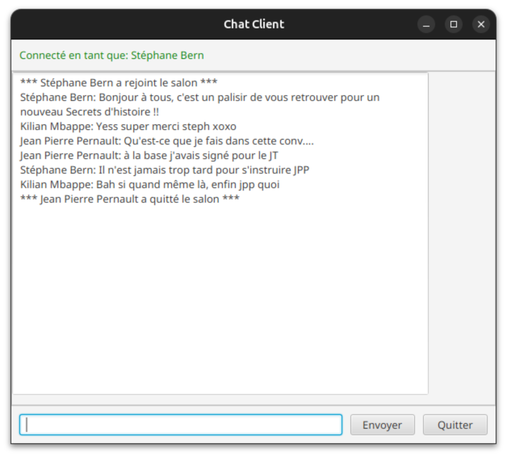
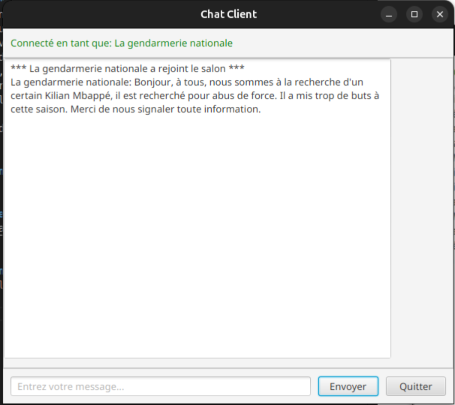
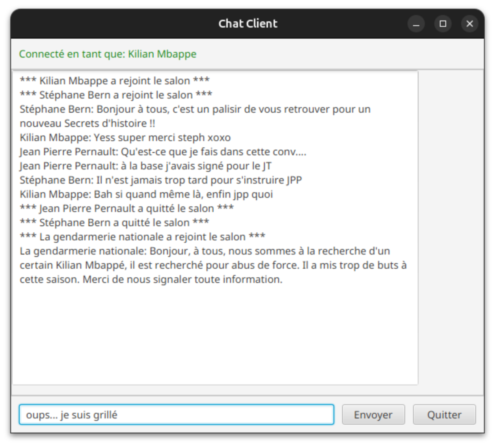
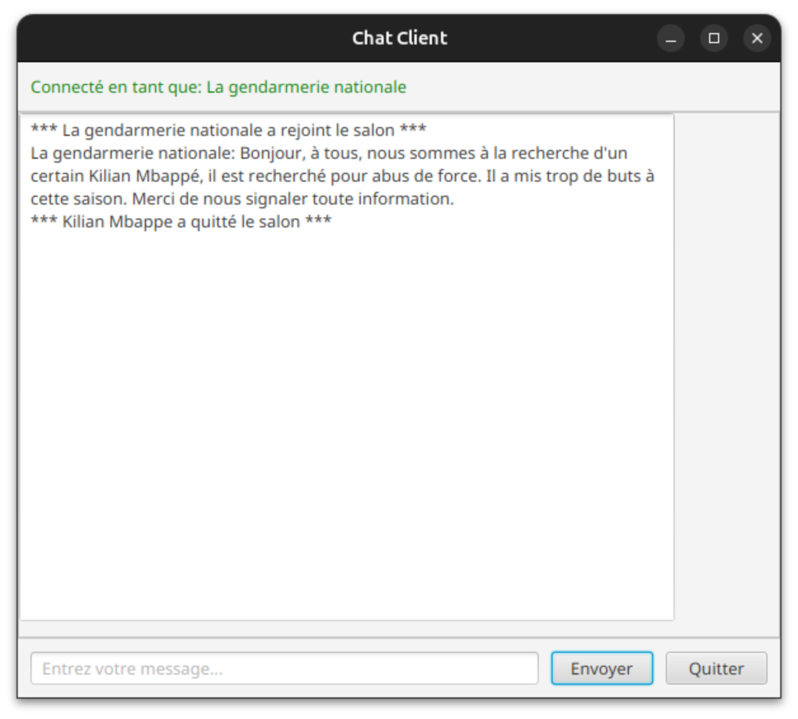

# Projet 1 - Développement d’une application de chat avec les sockets TCP

> **Document :** Rapport de TP\
> **Matière :** Développement Web en Java\
> **Filière :** INSA Hauts-de-France, Informatique et Cybersécurité 3A\
> **Groupe de travail:** 
>   - Maël Advisse
>   - Louison Bednarowicz





# Structure et méthodes du code

## 1. Architecture du code

Le projet est structuré en deux parties principales : le **Serveur** (dont les fichiers sont dans le dossier Serveur/) et le **Client** (à la racine).

```
├── Serveur/
│   ├── GestionClient.java
│   ├── Main.java
│   └── Serveur.java
├── Client.java
├── ClientGUI.java
├── README.md
└── Rapport.md
```


### A. Dossier `Serveur/`

#### `Main.java`
*   **Objectif :** Point d'entrée du serveur.
*   **Méthode `main(String[] args)` :**
    *   Définit le port (5001).
    *   Instancie un objet `Serveur`.
    *   Lance le serveur dans un `Thread` dédié.
    *   Ajoute un *Shutdown Hook* pour arrêter proprement le serveur (appel à `serveur.stop()`) lors de l'arrêt du programme.
*   **Appelle :** `Serveur` (constructeur et `run`), `Thread`.

#### `Serveur.java` (Implémente `Runnable`)
*   **Objectif :** Gère le socket serveur et la liste des clients connectés.
*   **Méthode `run()` :**
    *   Boucle infinie qui attend les connexions (`serverSocket.accept()`).
    *   Pour chaque connexion, crée un `GestionClient`, l'ajoute à la liste `clients`, et lance son thread.
*   **Méthode `broadcastToAll(String message)` :**
    *   Parcourt la liste des clients et envoie le message à chacun via leur méthode `sendToClient`.
    *   *Note :* Cette méthode est `synchronized`.
*   **Méthode `removeClient(GestionClient client)` :**
    *   Retire un client de la liste lors de sa déconnexion.
*   **Méthode `stop()` :**
    *   Ferme le socket serveur et déconnecte tous les clients.
*   **Appelle :** `GestionClient`, `Thread`.

#### `GestionClient.java` (Implémente `Runnable`)
*   **Objectif :** Gère la connexion d'un seul client spécifique (côté serveur).
*   **Méthode `run()` :**
    *   Initialise les flux d'entrée/sortie (`BufferedReader`, `PrintWriter`).
    *   Lit le pseudo du client.
    *   Boucle de lecture : attend les messages du client et demande au serveur de les diffuser (`serveur.broadcastToAll`).
    *   Gère la commande `/quit`.
*   **Méthode `sendToClient(String message)` :**
    *   Envoie un message brut uniquement à ce client (utilisé par le broadcast du serveur).
*   **Méthode `disconnect()` / `close()` :**
    *   Ferme les flux et le socket proprement.
*   **Appelle :** `Serveur.broadcastToAll`, `Serveur.removeClient`.

---

### B. Racine du projet (Côté Client)

Le client est disponible en deux versions.

#### `Client.java` (Version Terminal)
*   **Objectif :** Client léger fonctionnant dans la console. Utilise des **classes internes** pour gérer l'asynchronisme.
*   **Classe interne `ReceptionThread` (extends `Thread`) :**
    *   **`run()` :** Écoute en boucle les messages du serveur (`in.readLine()`). Gère l'effacement de la ligne "Vous:" pour un affichage propre.
*   **Classe interne `EnvoiThread` (extends `Thread`) :**
    *   **`run()` :** Lit les entrées clavier de l'utilisateur (`Scanner`) et les envoie au serveur. Gère la commande `/quit`.
*   **Méthode `main` :**
    *   Connecte le socket.
    *   Instancie et démarre les deux threads (`ReceptionThread` et `EnvoiThread`).
    *   Attend la fin du thread d'envoi (`join`) pour fermer l'application.

#### `ClientGUI.java` (Version JavaFX)
*   **Objectif :** Interface graphique utilisateur (GUI) pour le chat.
*   **Méthode `start(Stage primaryStage)` :**
    *   Construit l'interface (TextArea, TextField, Buttons).
    *   Configure les événements (clic bouton envoyer, touche Entrée).
*   **Méthode `connectToServer(String pseudo)` :**
    *   Établit la connexion socket et initialise les flux.
*   **Classe interne `ReceptionThread` :**
    *   Écoute le serveur et met à jour l'interface graphique via `Platform.runLater()` (car seul le thread UI peut toucher à l'interface).

---

## 2. Nouveautés utilisées dans ce projet

Dans ce projet, nous avons utilisé des notions que nous ne connaissions pas avant, et pour lesquelles nous avons dûr effectuer quelques recherches.

> **Les Classes Internes**
> Utilisées dans `Client.java` (`ReceptionThread`, `EnvoiThread`), elles nous permettent de définir des classes directement à l'intérieur d'une autre. Cela facilise l'accès aux flux du client aux threads qui en ont besoin.

> **Le mot-clé `volatile`**
> Utilisé pour les booléens de contrôle (`private volatile boolean running = true`). En Java, les threads peuvent mettre en cache des variables. Le mot-clé `volatile` garantit que la valeur est toujours lue **depuis la mémoire principale**. Si le thread principal met `running` à `false`, les autres threads le voient immédiatement et s'arrêtent.

> **Le mot-clé `synchronized`**
> Utilisé dans `Serveur.java` (par exemple: `broadcastToAll`). Comme plusieurs threads (ceux des `GestionClient`) peuvent essayer d'envoyer des messages ou de se déconnecter en même temps, il y a un risque de conflit d'accès à la liste `clients`. `synchronized` pose un "verrou" : un seul thread peut exécuter cette méthode à la fois, ce qui garantit l'intégrité des données.

---

## 3. Fonctionnement Global du Projet

Le projet repose sur une architecture **Client-Serveur TCP/IP** avec une gestion de Threads qui permet des échanges dans les 2 sens en temps réel.

1.  **Démarrage :** Le serveur est lancé en premier. Il ouvre un port (5001) et se met en écoute passive.
2.  **Connexion :** Les clients se connectent au serveur. Nous avons le choix entre deux interfaces :
    *   **L'interface Terminal (`Client.java`) :**
    *   **L'interface Graphique (`ClientGUI.java`) :** Utilise le module JavaFX, en ouvrant une fenêtre et gère l'affichage d'une zone de texte pour envoyer des messages (et des boutons de déconnexionet d'envoi).
3.  **Communication :**
    *   Lorsqu'un client envoie un message, il est reçu par son `GestionClient` dédié sur le serveur (1 Thread par Client)
    *   Le serveur renvoie ce message à **tous** les autres clients connectés via la méthode de diffusion (`broadcast`).
    *   Côté réception, les clients (GUI ou Terminal) écoutent en permanence sur un thread séparé pour afficher le message dès son arrivée, sans bloquer la saisie de l'utilisateur.

Ce système permet une discussion asynchrone avec plusisuers utilisateurs.


## Captures de fonctionnement


### Démarrage et saisie du pseudo


### Une nouvelle personne rejoint le Chat


### Envoi d'un message à tous les utilisateurs


### Réception d'un message


### Quitter la conversation
Il est possible d'envoyer `/quit` ou de cliquer sur le bouton **Quitter**

